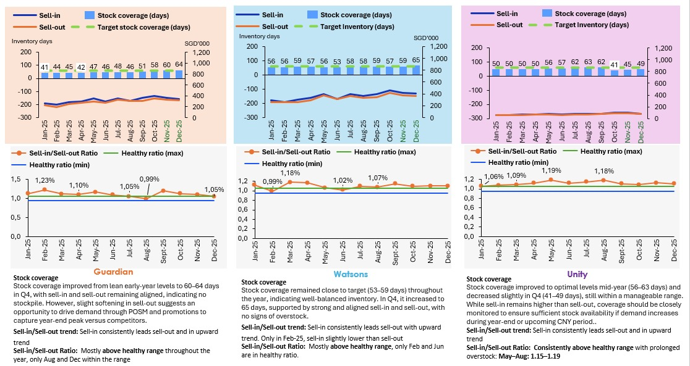

# 📈 Commercial Analytics: Skincare Retail Dashboard
**Technical Assessment | Sample Data | Retail S&OP**

---

## 🖼️ Analysis Visualization

---

## 🎯 Executive Summary
Analysis of 2025 performance for a skincare brand across **Guardian, Watsons, and Unity**. This case study evaluates the balance between **Sell-in** (Trade) and **Sell-out** (Market) to optimize inventory.

---

## 📊 Commercial Health Metrics
| Metric | Purpose | Target / Logic |
| :--- | :--- | :--- |
| **Sell-in vs Sell-out** | Channel Flow | Tracks trade vs. consumer demand |
| **S-in/S-out Ratio** | Health Check | **Healthy Range:** 0.95-1.05 (Balanced) |
| **Stock Coverage** | Inventory | **Goal:** 45–60 Days |

---

## 🔍 Key Insights & Strategy

### 1. Guardian: Promotion Opportunity
**Status:** 🟡 Strategic Pivot Required

*   **Inventory Level:** Stock coverage recovered to **60–64 days** by Q4.
*   **Market Dynamics:** Sell-in and sell-out remain aligned, but a "softening" in consumer demand has been noted.
*   **Efficiency:** The sell-in/sell-out ratio was above healthy ranges for most of the year, only normalizing in **August** and **December**.
*   **Strategy:** 
    *   Deploy **POSM (Point of Sale Materials)** immediately.
    *   Launch targeted promotions to capture year-end traffic and offset demand softening.

### 2. Watsons: Operational Efficiency
**Status:** 🟢 High Stability

*   **Inventory Level:** Maintained close to the **53–59 day** target, with a slight intentional increase to **65 days** in Q4.
*   **Market Dynamics:** Strong, aligned sales trends with a consistent upward trajectory.
*   **Efficiency:** Healthy ratios were specifically peaked in **February** and **June**.
*   **Strategy:** 
    *   Maintain current supply chain flow; no signs of overstocking risk.
    *   Support the upward sales trend with continued stock availability.

### 3. Unity: Overstock Management
**Status:** 🔴 Monitoring Required

*   **Inventory Level:** Decreased to **41–49 days** in Q4 after peaking mid-year.
*   **Market Dynamics:** Persistent overstock issues identified from **May to August** (Ratios: 1.15–1.19).
*   **Efficiency:** Sell-in consistently leads sell-out, creating a bottleneck.
*   **Strategy:** 
    *   **Urgent:** Ensure stock availability for Year-End and CNY (Chinese New Year) peaks.
    *   Tighten monitoring to prevent the recurrence of the Q2/Q3 overstock bubble.

### **4. Strategic Action Plan**
* **Inventory Leveling:** Align Unity ordering patterns to prevent mid-year bloat.
* **Commercial Timing:** Use periods of high stock (Guardian) to launch aggressive marketing campaigns.

---

## 🛠️ Tech Stack
* **Think-Cell:** Professional consulting-style visualizations.
* **Excel:** Data modeling and ratio logic.

## 🔗 More Projects
📊 [Power BI IMS Dashboard Enhancement – Healthcare](https://github.com/thaotracy-sg/powerbi-ims-dashboard-enhancement-healthcare)  
🛒 [SQL + R Customer Survey Pipeline](https://github.com/thaotracy-sg/sql-r-customer-survey-pipeline)  
📱 [Causal Analysis Using Panel Logit Model – Game App](https://github.com/thaotracy-sg/Causal-analysis-panel-logit-R-gameapp)  
🌿 [Sustainable Brand Logit Analysis](https://github.com/thaotracy-sg/Sustainable-brand-logit-analysis)  
🔋 [Time Series Forecasting – Electric Power & CO2 Emissions](https://github.com/thaotracy-sg/Time-series-forecasting-electric-power-co2-emission-europe)  

